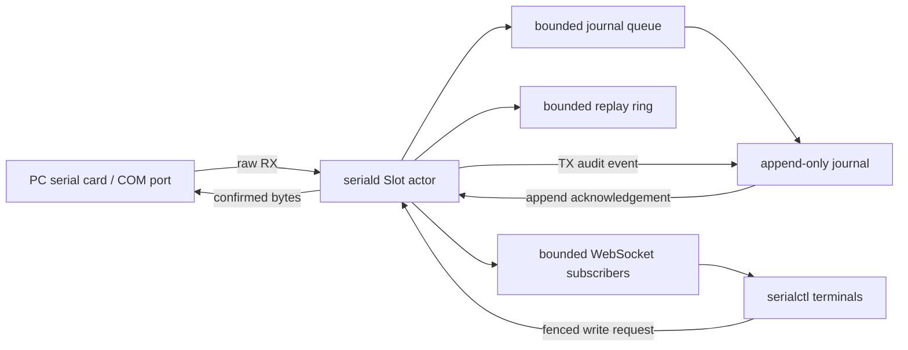

# Serial Platform Architecture

## Ownership boundary

This directory is a standalone Rust workspace:

- `serial-protocol`: versioned DTOs and WebSocket envelope codec only.
- `seriald`: configuration, authentication, serial actors, control/Run state,
  journal, HTTP APIs, and WebSocket subscriptions.
- `serialctl`: remote setup, diagnostics, log query, and the human terminal.
- `serial-mcp`: thin Agent-facing MCP transport and bounded operation adapter.

No crate imports OpenChamber or an Agent SDK. OpenCode and Codex both consume
`serial-mcp`; future Claude Code and OpenChamber integrations can reuse it or
consume the same platform protocol.

`serial-mcp` owns no physical-port lifecycle. It reads authoritative snapshots
and journals over HTTP, observes realtime events over WebSocket, and keeps one
Agent control connection with bounded lease renewal. It can queue for control
but cannot request takeover, configure/remove a Slot, suspend/close a serial
handle, or flash a target. Its stable tools are `devices`, `read`, `command`,
`wait`, `search`, `run_start`, `run_end`, and `release`.

Agent `search` defaults to the active Run. Cross-Run or old-epoch history is
never inferred from a text match: current-cursor and archive scopes require an
explicit cursor/epoch. `command` attaches before TX, creates an Operation UUID,
captures a bounded event window, and marks any foreign TX as interference.
Prompt/quiet matches are reported as completion evidence, not proof of command
success. The adapter never automatically retries an uncertain write.

## Identity model

The identities have deliberately different lifetimes:

| Field | Meaning | Changes when |
|---|---|---|
| Slot | Stable station channel such as `slot-1` | User reconfigures the station |
| Port | OS endpoint such as `COM3` | OS/topology mapping changes |
| server_id | One seriald installation | Configuration is recreated |
| daemon_epoch | One daemon process | `seriald` restarts |
| generation | Physical session for one Slot | Port successfully reopens |
| seq | Ordered logical event in one Slot/epoch | Every timeline event |
| RX/TX offset | Exact byte position in one direction | Confirmed bytes arrive/write |
| Run | User/adapter-defined debug interval | Explicit start/end/abort |

The durable cursor is `(slot_id, daemon_epoch, seq)`. A bare `seq` is never
enough to continue after a daemon restart. A generation change revokes the old
control lease and aborts an active Run.

The WebSocket `hello` declares an audit source kind (`human`, `agent`, or
`script`) and label. `seriald` validates that declaration, rejects the reserved
`system` kind, and issues a fresh opaque actor ID for the connection. When
several clients share one bearer token, the declared kind and label improve the
timeline audit trail but are not cryptographically verifiable user identities.

## Data flow



The serial worker owns the OS handle. Its read and write halves run independently:
RX is coalesced for at most 4 ms or 4 KiB, while each write is limited to 4 KiB
and a two-second deadline. A 4,096-entry RX queue absorbs ordinary storage or
scheduler stalls; saturation drops bytes instead of blocking the OS reader and
creates an explicit overflow event with the dropped byte count.

A Slot actor serializes state changes, assigns `seq`, validates fencing, and
publishes events. On the healthy path it waits at most 100 ms for a journal
append acknowledgement before live delivery. If storage stalls, live delivery
continues with `durable=false`, logging becomes explicitly degraded, and later
journal sequence jumps become persisted gaps. Historical scans run on bounded
blocking workers and cannot occupy the journal writer or serial reader.

## Serial and liveness state

The OS-handle state is independent from target activity:

```text
Disabled
WaitingForPort -> Opening -> Online
                     |          |
                     v          v
                  Backoff <-----+
```

- `endpoint_present`: the configured COM endpoint is enumerated.
- `session_state=online`: the daemon owns an open handle.
- `target_activity=active`: RX was observed recently.
- `target_activity=silent`: the handle is open but no recent RX was observed.
- `target_activity=unknown`: no observation justifies active or silent.

Silence never means dead. v1 deliberately performs no background probe because
an unsolicited command can alter a bootloader or shell state.

Hardware flow control gives RTS ownership to the serial driver; a configuration
that also requests `rts=true` is rejected and `seriald` does not manually write
RTS after open. The agreed station default remains no flow control with RTS low.
On Linux, the serial driver can transiently assert DTR while opening even when
the requested final value is low. v1 cannot promise pulse-free Linux opens. For
DTR-reset-sensitive targets, validate the Windows-host behavior, disable
automatic reopen when the port must remain untouched, or add electrical
isolation/reset gating.

## Control and Runs

Every write requires the current `control_id`, `daemon_epoch`, `generation`, and
monotonically increasing fencing value. The server rejects a stale ID/fence
before touching the physical port. Leases have bounded TTL and clients renew
them while active. TTL enforcement uses a monotonic clock; wall-clock expiry is
display-only and cannot be extended by changing the system time.

- A normal acquire queues behind the current owner.
- A Slot accepts at most 128 distinct waiters. A queued actor expires after 60
  seconds unless it explicitly requests control again; an expired waiter is
  never promoted later into an unrelated target state.
- An explicit takeover revokes the current owner.
- `serialctl` keeps queued position/age/input visible. Because v1 has no
  cancel-acquire message, cancelling a queued human command deliberately
  reconnects that actor: all of its queues and controls are released, then its
  Slot subscriptions attach again.
- `serialctl` renews a human lease only while that Slot has manual activity or
  an in-flight write. It releases the lease after 60 seconds idle; queued human
  input also expires after 60 seconds idle.
- Disconnect, expiry, takeover, or serial close releases control.
- A client disconnect releases control immediately; it is not held until TTL.
- Releasing/revoking control aborts an active Run.
- One Slot has at most one active Run.
- Run boundaries do not reset or clean the target; they only define an exact
  event interval.
- A checkpoint is a finer marker inside a Run and is not an Agent tool in v1.
- Run/checkpoint labels must be non-empty, already trimmed, contain no control
  characters, and be at most 256 UTF-8 bytes.
- Run metadata is limited to 64 top-level keys and 16 KiB of encoded JSON.
  Validation happens before the request enters the idempotency cache.

Each request has a UUID. Non-write requests use a bounded actor-scoped cache.
Writes use a separate result cache keyed by
`(Slot, daemon_epoch, request_id)`; their stable fingerprint contains only bytes
plus `operation_id`, so a recent duplicate can return the same result after a
WebSocket reconnect issues a new actor and lease. A cache hit still has to
present the current actor's valid control ID and fence.

The smaller result cache is backed by an exact, non-evicting set of up to
262,144 executed write request IDs per Slot/daemon epoch. Once a detailed
result ages out, reusing that ID returns `idempotency_expired` and never reaches
the physical port. At the history ceiling, new writes return
`resource_exhausted` until seriald restarts into a new epoch; the daemon never
silently forgets an executed ID and accepts it again. Confirmed and
partial/uncertain physical writes enter this history; definite pre-execution
failures such as no control, empty data, or an offline queue do not.
`serialctl` never blindly replays disconnected input and keeps a visible warning
for every sent write whose acknowledgement was lost, directing the operator to
inspect the TX timeline before retrying.

## Timeline events

RX is an event, but never one event per byte. The serial worker reads bounded
coalesced chunks and the TUI redraws at a separate 30 FPS ceiling. Timeline
kinds in v1 cover RX, confirmed TX, serial open/close/failure, Slot
reconfiguration/removal, control transitions, Run transitions, checkpoints,
logging degradation, and explicit gaps. Removing a Slot publishes
`SlotRemoved` and projects it as Disabled in the TUI. The registry retains the
actor, sequence, replay ring, and live channel so rolling back or re-adding the
same ID can continue with a `SlotReconfigured` event instead of inventing a new
timeline.

Control-plane messages such as hello, attach, result, ping, and pong are not
timeline events and do not consume `seq`.

Raw RX/TX payloads never pass through UTF-8 conversion in the protocol or
journal. ANSI cleanup, CR/backspace handling, semantic coloring, and repeated
line presentation belong only to `serialctl`'s derived view.
Human-readable live and log views include the sanitized actor label and actor
ID (compact ID in the TUI, full ID in ordinary logs), so Agent, script, and
human writes and control transitions remain distinguishable. LINE/RAW mode and
command history are maintained independently for every Slot.

The in-memory replay ring is bounded by event count and an estimated resident
byte size. Its accounting includes raw data, actor/Slot strings, Run and
Operation IDs, recursively encoded metadata, and map-entry overhead; large
control metadata therefore cannot bypass the ring's memory ceiling.

## WebSocket protocol

Endpoint: `GET /api/v1/ws`, authenticated by `Authorization: Bearer …`.
Incoming WebSocket messages and frames are capped at 64 KiB.

Binary envelope:

```text
[tag: u8][JSON header length: u32 big-endian][JSON header][raw payload]
```

- `0x01`: control/state/non-byte timeline JSON.
- `0x02`: device RX header plus raw bytes.
- `0x03`: confirmed TX audit header plus raw bytes.
- `0x04`: reserved for a future high-rate raw write frame.

One connection attaches multiple Slots. For each attach, the daemon subscribes
first, captures a snapshot with head `H`, sends snapshot/gap/replay/ready, then
forwards live events with `seq > H`. This avoids a loss window during attach.

A slow subscriber never blocks serial reading. Broadcast lag produces an
explicit `lagged(from_seq,to_seq)` and detaches only that Slot subscription;
the client recovers from the journal and reattaches.

The daemon accepts at most 256 simultaneous WebSocket connections. Each has a
bounded 512-frame outbound channel; excess upgrade requests receive HTTP 429.
Together with the per-Slot waiter bound, a faulty authenticated client cannot
grow connection or control-queue state without limit.

## HTTP API

All endpoints require a role token.

| Method/path | Minimum role | Purpose |
|---|---|---|
| `GET /api/v1/health` | observer | Process identity and uptime |
| `GET /api/v1/status` | observer | Authoritative Slot snapshots |
| `GET /api/v1/ports` | admin | Enumerate ports on the daemon host |
| `PUT /api/v1/config/slots` | admin | Validate, persist, and replace Slots |
| `GET /api/v1/archives` | observer | List bounded retained Slot/epoch archives |
| `GET /api/v1/slots/{id}/events` | observer | Bounded durable query |
| `GET /api/v1/ws` | observer | Realtime protocol; writes require operator |

Config writes run under one mutation gate: validate the full replacement,
pause affected actors, hold replacement configs privately inside those actors,
and create new actors in an administratively paused state. While persistence is
pending, candidate actors cannot open a COM port and existing authoritative
snapshots/WebSocket subscribers retain the old topology; no
`SlotReconfigured` or `SlotRemoved` event is emitted. The daemon then atomically
saves the configuration before it activates the staged actors and publishes the
new registry maps. A save failure discards candidate actors, clears all staged
configs, and resumes the old active actors without ever publishing the rejected
topology. Existing Slot IDs are reconfigured in place: changed/removed ports
are fully stopped first, unchanged actors keep their sequence/ring/live
channel, and only genuinely new Slot IDs create new actors.

## Journal

The source of truth is a per-Slot/per-daemon-epoch binary segment. Every record
has a bounded JSON header, unchanged raw payload, length, and CRC. Active files
use `.open`; sealed files use `.slog`.

- Rotate at 64 MiB, one hour, shutdown, or epoch end.
- On startup, scan `.open`, keep the complete CRC-valid prefix, truncate a
  partial tail, and seal it.
- On startup and before every gap append, scan the gap JSONL ledger to its last
  complete, semantically valid newline-terminated record and truncate a torn
  tail. A later gap can therefore never be concatenated into an incomplete
  line and silently disappear from queries.
- Reject non-monotonic sequence; persist a gap when sequence jumps.
- Enforce a 10 GiB ceiling by deleting only oldest sealed segments until 90%.
- Persist deleted ranges in a gap ledger. Queries never turn a deleted range
  into an empty-success lie.
- Query limits are capped by both event count and byte count.
- At most two historical scans run concurrently; one scan stops after 256 MiB
  or five seconds and returns `truncated=true` with a continuation cursor.
- `GET /api/v1/archives` shares that same semaphore, time/byte budget, and a
  16,384-segment discovery ceiling. It aggregates only segment headers, file
  metadata, and fixed-buffer validation of an active segment; it never retains
  raw event payloads. The response is capped at 4,096 newest archives and marks
  itself truncated if entries were omitted or unreadable. An optional
  `slot_id` filter applies before traversal.
- The journal layer defines an omitted epoch as the latest archived epoch, but
  the public HTTP API deliberately fills it with the current daemon epoch so a
  normal query cannot match a previous test cycle. Archive reads supply an
  explicit epoch. Search supports explicit seq/time/direction/kind/actor/Run/
  Operation/text filters, and text matching carries a bounded window across
  adjacent RX or TX events so an OS read boundary does not hide a keyword.
  Returned payload remains exact bytes.
- Queries independently compare adjacent retained records after the requested
  cursor. Any unexplained sequence jump becomes a conservative
  `sequence_discontinuity` gap, including the interval from `after_seq` to the
  first scanned record. Existing retention, corruption, or logging-fault gaps
  take precedence, and filtering a present event never turns it into a gap.

Use `serialctl archives [--slot ID]` to find an archived daemon epoch before
querying it with `serialctl logs --epoch UUID`. Log time filters are strict
RFC3339 bounds (`--after-time` and `--before-time`) with an explicit timezone;
direction filters accept RX, TX, or non-byte (`none`) events. Human output uses
the client's local RFC3339 time at millisecond precision and includes sequence,
generation, kind, and source. JSON preserves the exact nanosecond timestamp and
all raw protocol fields.
Archive catalog timestamps are segment-creation bounds and are labeled
`segment-open`; they are not exact first/last event timestamps. A human `logs`
query without Run/Operation or seq/time bounds warns that it spans the complete
selected epoch and can include older test cycles. Text matching only filters
that selected range and is not itself a test-cycle boundary.

`durable=true` means a complete record was appended and flushed to the OS. It
survives a daemon process crash under normal filesystem semantics; it is not a
zero-loss power-failure promise because every event does not call `sync_data`.

The initial implementation scans segment metadata rather than depending on a
database. A rebuildable SQLite sparse catalog and independently compressed
frames are later optimizations; neither may become the raw source of truth.

## Security boundary

The first config creates independent observer/operator/admin 256-bit tokens.
They are redacted from `Debug` and errors, accepted only through the
Authorization header/token file, and used by the server to issue a
connection-bound actor identity. Clients cannot claim the system actor.

On Unix, seriald/serialctl configuration directories are mode `0700`; token and
daemon credential files are created as mode `0600` through a private temporary
file, flushed, and atomically replaced. On Windows, files inherit the current
user profile directory ACL. Explicit ACL auditing/hardening for shared service
accounts remains roadmap work; tokens must never appear in errors or logs.

v1 network transport is plain HTTP for loopback and a trusted VM host-only
network only. Ordinary LAN, VPN, or Internet use requires the roadmap TLS or a
trusted private transport plus firewall scoping.

## Required invariants

Tests and future changes must preserve:

1. `(slot, daemon_epoch, seq)` is strictly ordered and unique.
2. Restart changes epoch and invalidates old cursors, leases, and writes.
3. Reopen changes generation and invalidates control/active Run.
4. Snapshot/replay/live attachment cannot lose or duplicate a sequence.
5. Ring eviction, retention, corruption, writer faults, and otherwise
   unexplained retained-sequence discontinuities are explicit gaps.
6. A slow client cannot block the serial worker or another client.
7. Stale fencing never reaches the OS write call.
8. TX is emitted only for bytes accepted by the serial driver; a partial write
   is reported as non-retryable with generation/event/operation context, its
   confirmed prefix is audited once, and the uncertain physical session closes.
9. Raw NUL, invalid UTF-8, CR, ANSI, and all 0–255 values round-trip unchanged.
10. Serial silence is never represented as target death.
11. One failed Slot/config/query cannot erase unrelated authoritative state.
12. Tokens never enter logs, URLs, process arguments, or normal debug output.
13. An unpersisted Slot candidate cannot open a port or enter an authoritative
    snapshot/WebSocket timeline; save failure restores the prior active set.
