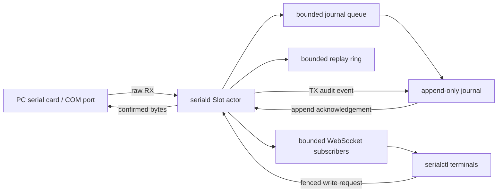

# Serial Platform Architecture

## Ownership boundary

This directory is a standalone Rust workspace:

- `serial-protocol`: versioned DTOs and WebSocket envelope codec only.
- `seriald`: configuration, authentication, serial actors, control/Run state,
  journal, HTTP APIs, and WebSocket subscriptions.
- `serialctl`: remote setup, diagnostics, log query, and the human terminal.
- `serial-mcp`: thin Agent-facing MCP transport and bounded operation adapter.

No crate imports OpenChamber or an Agent SDK. OpenCode and Codex both consume
`serial-mcp`; future Claude Code and OpenChamber integrations can reuse it or
consume the same platform protocol.

`serial-mcp` owns no physical-port lifecycle. It reads authoritative snapshots
and journals over HTTP, observes realtime events over WebSocket, and keeps one
Agent control connection with bounded lease renewal. It can queue for control
but cannot request takeover, configure/remove a Slot, suspend/close a serial
handle, or flash a target. Its stable tools are `devices`, `read`, `command`,
`wait`, `search`, `trigger`, `run_start`, `run_end`, and `release`.

Agent `search` defaults to the active Run. Cross-Run or old-epoch history is
never inferred from a text match: current-cursor and archive scopes require an
explicit cursor/epoch. A truncated active-Run search accepts its returned
current-epoch `after_seq` while retaining the same `run_id` filter. The caller
must page until `truncated=false` before treating an empty result as absence;
continuation guidance takes precedence over archive guidance.
`command` first requires a Run started by this `serial-mcp` process. It attaches
before TX, creates an Operation UUID, sends that Run as `expected_run_id`, then
uses the confirmed TX audit sequence as the authoritative lower bound of its
bounded output window. The Slot actor checks the expected ID and server-issued
Run owner together with the current control/fence before any pacing budget or
physical write. The confirmed TX sequence is the hard lower bound: earlier RX
is excluded. With authoritative `echo=on`, a complete command plus EOL echo
(including the target's `CR CR LF` hard wraps) is stripped and provides the
strongest confidence. A requested literal, regex, or prompt observed after TX
may still complete when echo is missing or incomplete, but the result is
explicitly marked `echo_missing`, suspected input loss, and uncertain
delivery; it is never retried automatically. Bytes that can still be part of a
partial command echo are withheld from matching, so an `until` token inside
the command cannot complete early. Quiet completion requires at least one
post-TX RX event. Results expose prewrite activity, boundary confidence,
discarded pre-boundary RX, and any foreign TX as interference; an interfered
echo is never presented as isolated evidence. Because serial RX has no causal
response envelope, a prompt first sequenced after TX with no recognizable echo
can only be reported as lower-confidence evidence; use a unique sentinel when
that ambiguity is unsafe.
Prompt/contains modes wait for their exact boundary or timeout; a transient
quiet gap cannot end them. An explicit `until_regex` is the sole authoritative
completion boundary: configured prompts, literal matches, and quiet intervals
are disabled until the regex matches or the operation times out. Competing
`until` or explicit prompt/contains/quiet completion parameters are rejected,
and results report `completion_mode=regex`. Every match is reported as
completion evidence, never proof of command success; the generic adapter does
not rewrite a command to inspect a shell-specific exit code. The Operation UUID
belongs to confirmed TX audit events only. Device RX has `operation_id=null`
because shared serial bytes cannot be assigned causally, so responses are
scoped by the command capture window, Run, or exact cursor.
Literal search renders matching lines with bounded context by default while
leaving returned event/raw evidence and cursor semantics unchanged. The adapter
never automatically retries an uncertain write.

The MCP session uses operation-specific RPC limits: ordinary control requests
remain bounded to five seconds, Run-start control queueing is capped at 15
seconds with a five-second response margin, and a write waits 20 seconds so it
cannot pre-empt seriald's legal 15-second physical-write deadline. Only Slots
with Runs started by this adapter process receive periodic lease renewal.
`command` renews that existing lease and fails closed instead of reacquiring
control after Run/lease loss. Disconnect or renewal failure clears the adapter's
owned-Run ledger. Successful `run_end` removes the Run from renewal before a
best-effort release; a failed release leaves at most the server TTL and never
closes the port. Explicit release is idempotent without a local lease.
Seriald's explicit Run, pacing-budget, and lease-too-short rejections say that
no bytes were written and are reported as safe to retry after correction;
transport loss, timeout, and partial writes remain outcome-uncertain and are
never retried automatically.

`serial-mcp` also keeps a process-local, per-Slot live cursor so a delayed RX
event cannot fall into the gap between one tool response and the next `wait`
attachment. A successful `run_start` records the Run's `start_seq`; `command`
and `wait` record the highest sequence actually observed. Filtered `read` and
`search` calls deliberately do not advance it because their returned cursor can
skip unmatched RX. The cursor advances monotonically within one daemon epoch.
When `wait` receives an explicit `(epoch, after_seq)` pair,
that pair always wins. Otherwise it resumes the remembered live cursor and
falls back to the current Slot head only when no cursor exists or the remembered
cursor belongs to another daemon epoch or is ahead of the authoritative head.
Every `wait` result reports `cursor_source` (`explicit`,
`session_live_cursor`, or `current_head`) and `started_after_seq` alongside its
ending cursor. This ledger is deliberately not durable: after `serial-mcp`
restarts, callers that require an older exact boundary must provide the cursor
explicitly.

`trigger` is the sole low-latency Agent write primitive beyond `command`. It
requires a Run owned by this adapter process and submits one bounded,
device-agnostic Trigger Job to `seriald`; the adapter does not loop writes
across the host/VM boundary. Initial/action text, EOL, and start/stop literals
are explicit call parameters and are never inferred from a device profile. The
MCP v1 arguments expose UTF-8 `text` plus `eol`; the lower WebSocket protocol
remains byte-oriented and carries arbitrary raw Trigger payloads and literals
as base64. The adapter attaches before starting the Job, waits for an
authoritative terminal state on a separate live channel, keeps lease renewal
available, and returns a bounded Run/cursor-scoped capture. A matched literal
is evidence that the requested serial state was observed, not proof that a
larger workflow such as firmware flashing succeeded.

## Identity model

The identities have deliberately different lifetimes:

| Field | Meaning | Changes when |
|---|---|---|
| Slot | Stable station channel such as `slot-1` | User reconfigures the station |
| Port | OS endpoint such as `COM3` | OS/topology mapping changes |
| server_id | One seriald installation | Configuration is recreated |
| daemon_epoch | One daemon process | `seriald` restarts |
| generation | Physical session for one Slot | Port successfully reopens |
| seq | Ordered logical event in one Slot/epoch | Every timeline event |
| RX/TX offset | Exact byte position in one direction | Confirmed bytes arrive/write |
| Run | User/adapter-defined debug interval | Explicit start/end/abort |

The durable cursor is `(slot_id, daemon_epoch, seq)`. A bare `seq` is never
enough to continue after a daemon restart. A generation change revokes the old
control lease and aborts an active Run.

The WebSocket `hello` declares an audit source kind (`human`, `agent`, or
`script`) and label. `seriald` validates that declaration, rejects the reserved
`system` kind, and issues a fresh opaque actor ID for the connection. When
several clients share one bearer token, the declared kind and label improve the
timeline audit trail but are not cryptographically verifiable user identities.

## Data flow


```mermaid
flowchart LR
    Card["PC serial card / COM port"] -->|raw RX| Actor["seriald Slot actor"]
    Actor --> Queue["bounded journal queue"]
    Queue --> Journal["append-only journal"]
    Journal -->|append acknowledgement| Actor
    Actor --> Ring["bounded replay ring"]
    Actor --> WS["bounded WebSocket subscribers"]
    WS --> Human["serialctl terminals"]
    Human -->|fenced write request| Actor
    Actor -->|confirmed bytes| Card
    Actor -->|TX audit event| Journal
```

The serial worker owns the OS handle. On Unix its asynchronous read and write
halves run independently. On Windows, `seriald` deliberately uses the native
synchronous `COMPort` backend with one duplicated handle for the reader and one
for the writer. The reader uses a nominal 4 ms driver-queue polling interval
before calling `ReadFile`; the writer uses a finite communication timeout.
Both blocking workers must finish and drop their handles before the Slot may reopen. This
avoids a Windows `tokio-serial`/named-pipe failure mode where a timed-out
overlapped write can outlive the Rust task, retain the exclusive COM handle,
and make every reopen fail with access denied.

RX is coalesced for at most 4 ms or 4 KiB, while each write is limited to 4 KiB
and chunked by the effective pacing — `write_chunk_size` bytes, then
`write_chunk_delay_ms` between chunks (the default is a 1 byte/1 ms typewriter
cadence; a zero delay disables pacing and a single request can override both).
The write deadline is at least two seconds. Paced requests add twice the
configured inter-chunk delay plus a conservative 20 ms scheduler/driver
allowance for every additional chunk; this covers the roughly 15 ms cadence
that a nominal 1 byte/1 ms write can exhibit on Windows. An individual driver
write that makes no progress still times out after two seconds. Before a
request enters the port worker, `seriald` computes its complete pacing budget;
if that budget exceeds 15 seconds, the request is rejected as a bad request
with an explicit required/maximum duration and no bytes reach the driver.
The budget is never clamped into a deadline that would guarantee a partial
write. Legitimately slower transfers must use a validated larger chunk size or
be split. The daemon also compares the accepted budget plus a 100 ms scheduling
margin with the current lease's authoritative monotonic time remaining. If the
lease cannot cover it, the request returns a retryable conflict before entering
the port worker and tells the client to renew control or shorten the write.
Once accepted, a write keeps its fixed deadline and is not cancelled midway by
TTL expiry.
A
4,096-entry RX queue absorbs ordinary storage or
scheduler stalls; saturation drops bytes instead of blocking the OS reader and
creates an explicit overflow event with the dropped byte count.

A Slot actor serializes state changes, assigns `seq`, validates fencing, and
publishes events. On the healthy path it waits at most 100 ms for a journal
append acknowledgement before live delivery. If storage stalls, live delivery
continues with `durable=false`, logging becomes explicitly degraded, and later
journal sequence jumps become persisted gaps. Historical scans run on bounded
blocking workers and cannot occupy the journal writer or serial reader.

## Serial and liveness state

The OS-handle state is independent from target activity:

```text
Disabled
WaitingForPort -> Opening -> Online
                     |          |
                     v          v
                  Backoff <-----+
```

- `endpoint_present`: the configured COM endpoint is enumerated.
- `session_state=online`: the daemon owns an open handle.
- `target_activity=active`: RX was observed recently.
- `target_activity=silent`: the handle is open but no recent RX was observed.
- `target_activity=unknown`: no observation justifies active or silent.

Silence never means dead. v1 deliberately performs no background probe because
an unsolicited command can alter a bootloader or shell state.

Hardware flow control gives RTS ownership to the serial driver; a configuration
that also requests `rts=true` is rejected and `seriald` does not manually write
RTS after open. The agreed station default remains no flow control with RTS low.
On Linux, the serial driver can transiently assert DTR while opening even when
the requested final value is low. v1 cannot promise pulse-free Linux opens. For
DTR-reset-sensitive targets, validate the Windows-host behavior, disable
automatic reopen when the port must remain untouched, or add electrical
isolation/reset gating.

## Control and Runs

Every write requires the current `control_id`, `daemon_epoch`, `generation`, and
monotonically increasing fencing value. The server rejects a stale ID/fence
before touching the physical port. Leases have bounded TTL and clients renew
them while active. Requested TTLs are clamped between a five-second floor and
the `[control] max_ttl_ms` ceiling (default 60 seconds). TTL enforcement uses a
monotonic clock; wall-clock expiry is display-only and cannot be extended by
changing the system time. A valid lease authorizes a new write only when its
remaining monotonic lifetime covers the complete write budget plus the 100 ms
scheduling margin. A short or near-expiry lease must be renewed before retrying.
The configured lease ceiling is limited to 24 hours and the queued-acquire
timeout to one hour. Larger values are rejected during configuration
validation. Runtime limits apply the same bounds defensively for direct
in-process construction; unrepresentable monotonic deadlines fail closed
instead of panicking, and wall-clock expiry conversion saturates at `i64`
bounds.

- A normal acquire queues behind the current owner.
- A Slot accepts at most `[control] max_waiters` distinct waiters (default
  128). A queued actor expires after `[control] wait_timeout_ms` (default 60
  seconds) unless it explicitly requests control again; an expired waiter is
  never promoted later into an unrelated target state.
- An explicit takeover revokes the current owner.
- A client can withdraw its own queued acquire with `cancel_acquire`; the
  daemon removes only that actor's queue entry and answers
  `acquire_cancelled { removed }`. `serialctl` keeps queued position/age/input
  visible and still cancels a queued human command by deliberately
  reconnecting that actor: all of its queues and controls are released, then
  its Slot subscriptions attach again.
- `serialctl` renews a human lease only while that Slot has manual activity or
  an in-flight write. It releases the lease after 60 seconds idle; queued human
  input also expires after 60 seconds idle.
- Disconnect, expiry, takeover, or serial close releases control.
- A client disconnect releases control immediately; it is not held until TTL.
- Releasing/revoking control aborts an active Run.
- One Slot has at most one active Run.
- Run boundaries do not reset or clean the target; they only define an exact
  event interval.
- Agent writes set `expected_run_id`; the Slot actor requires that exact active
  Run to be owned by the writing actor before calculating a pacing budget or
  entering the port queue. Legacy/human writes may omit the field.
- A checkpoint is a finer marker inside a Run and is not an Agent tool in v1.
- Run/checkpoint labels must be non-empty, already trimmed, contain no control
  characters, and be at most 256 UTF-8 bytes.
- Run metadata is limited to 64 top-level keys and 16 KiB of encoded JSON.
  Validation happens before the request enters the idempotency cache.

Each request has a UUID. Non-write requests use a bounded actor-scoped cache.
Writes use a separate result cache keyed by
`(Slot, daemon_epoch, request_id)`; their stable fingerprint contains bytes,
`operation_id`, optional `expected_run_id`, and the requested pacing override,
so a recent duplicate can return the same result after a WebSocket reconnect
issues a new actor and lease. A cache hit still has to present the current
actor's valid control ID/fence and, when supplied, the same currently active Run
owned by that actor.

Every write iteration checks an already-signalled port cancellation and an
already-reached total deadline before polling the driver. Its biased wait order
is port cancellation, total deadline, the two-second no-progress deadline, then
the driver write. Cancellation or an exact deadline therefore cannot lose a
race to an immediately-ready driver and leak one extra byte.

The smaller result cache is backed by an exact, non-evicting set of up to
262,144 executed write request IDs per Slot/daemon epoch. Once a detailed
result ages out, reusing that ID returns `idempotency_expired` and never reaches
the physical port. At the history ceiling, new writes return
`resource_exhausted` until seriald restarts into a new epoch; the daemon never
silently forgets an executed ID and accepts it again. Confirmed and
partial/uncertain physical writes enter this history; definite pre-execution
failures such as no control, insufficient lease lifetime, empty data,
over-budget pacing, or an offline queue do not.
`serialctl` never blindly replays disconnected input and keeps a visible warning
for every sent write whose acknowledgement was lost, directing the operator to
inspect the TX timeline before retrying.

## Trigger Jobs

Protocol v2 adds a Slot-owned, bounded reaction primitive. It is not a flashing
recipe or workflow language:

```text
arm live byte matchers
-> optional one-time initial_write kickoff (not a fire)
-> optional start_contains gate
-> one bounded action write at a time
-> stop_contains match, timeout, max_fires, cancellation, or invalidation
```

All payloads and patterns are exact raw bytes. Matching is literal,
case-sensitive, and spans RX event boundaries; the daemon hot path does not
evaluate regular expressions or model-specific prompts. One Slot has at most
one active Trigger. The Job is bound to the initiating actor, Control ID/fence,
daemon epoch, physical generation, and optional expected Run. It never
survives daemon restart, reconnect, generation change, Run loss, Control loss,
port close, reconfiguration, or an RX gap.

The arming barrier first publishes every byte already ingested by seriald's
reader. Bytes still unread in the operating-system/serial-driver buffer cannot
be distinguished from bytes arriving immediately after the barrier and belong
to the new live window; callers should use a sufficiently specific start/stop
literal when a device is continuously producing output.

`initial_write` is performed at most once after all live matchers are armed; it
is the kickoff, not an action fire. `fires_confirmed` therefore counts only
confirmed `action` writes, while `tx_bytes_confirmed` includes confirmed bytes
from both the kickoff and actions. Each initial write and action fire uses the
ordinary bounded port writer and produces a normal confirmed TX audit event
tagged with Trigger/attempt metadata. There is at most one physical Trigger
write in flight. `interval_ms` is a delay after an action write is confirmed
before the next action becomes eligible; the action's pacing and physical-write
time are additional. Missed timer ticks are skipped rather than replayed as a
burst. A stop match prevents the next fire; bytes already accepted by the OS
driver cannot be retracted. `timeout_ms` likewise stops new scheduling, but an
already accepted write may take up to the ordinary 15-second physical-write
budget to settle and be audited before the Job reaches its authoritative
terminal state. Partial or uncertain writes terminate the Job and are never
retried automatically.

Trigger requests are rejected unless all of these hard limits hold:

| Field/budget | Allowed value |
|---|---|
| `initial_write` | Optional; 1–4,096 bytes when present |
| `action` | 1–256 bytes |
| `start_contains` | Optional; 1–256 bytes when present |
| `stop_contains` | 0–8 literals, each 1–256 bytes |
| `interval_ms` | 5–1,000 ms; default 20 ms |
| `timeout_ms` | 100–30,000 ms; default 5,000 ms |
| `max_fires` | 1–1,000 confirmed actions; default 250 |
| Planned TX | `len(initial_write) + len(action) * max_fires <= 65,536` bytes |
| Physical write | Each kickoff/action pacing plan must fit the ordinary 15-second write budget |
| Active Jobs | At most one per Slot |

While a Trigger is active, reads, subscriptions, status, cancellation, lease
renewal, release, Run termination, and explicit Human Takeover remain
responsive. Another actor may queue for Control, but the server never queues
actual command bytes behind the Trigger. Ordinary writes and a second Trigger
fail before reaching the port. Takeover first marks the Job stopping and blocks
new writes; a physical write already accepted by the driver is settled and
audited before the terminal lifecycle event and new owner can proceed. Completed
Trigger state is retained only in a bounded Slot-local result cache; the durable
timeline remains the long-term audit source.

`TriggerCompleted` is a lifecycle category, not a synonym for a successful
match: it covers terminal status `matched`, `timed_out`, and
`max_fires_reached`. Consumers must inspect event metadata `status`.
`matched=true` means only `status=matched`, and `matched_pattern` is the exact
caller-supplied stop literal that was observed. In the MCP result,
`capture_complete` is independent: it means the bounded adapter capture reached
the terminal lifecycle signal without truncation or a reported gap. It does not
mean a stop literal matched or that the surrounding workflow succeeded, and it
can be true for `timed_out` or `max_fires_reached`. Agent evidence is strictly
clipped to `start_seq..=end_seq`; events observed while status polling catches up
are reported only through `observed_through_seq`, and the remembered live cursor
stops at `end_seq` so a later `read`/`wait` can still consume them. If a read-only
terminal-status lookup had to recover after losing the adapter's connection,
`mcp_run_ownership_retained=false` preserves the terminal evidence while warning
that a new Run is required before any further write.

## Timeline events

RX is an event, but never one event per byte. The serial worker reads bounded
coalesced chunks and flushes on 4 KiB or no later than 4 ms after the first
pending byte; continuous output cannot keep extending that deadline. The TUI
redraws dirty state at a separate 30 FPS ceiling, which limits redundant screen
painting rather than delaying serial reads. Timeline kinds cover RX,
confirmed TX, serial open/close/failure, Slot
reconfiguration/removal, control transitions, Run transitions, checkpoints,
Trigger lifecycle transitions, logging degradation, and explicit gaps. Removing a Slot publishes
`SlotRemoved` and projects it as Disabled in the TUI. The registry retains the
actor, sequence, replay ring, and live channel so rolling back or re-adding the
same ID can continue with a `SlotReconfigured` event instead of inventing a new
timeline.

Control-plane messages such as hello, attach, result, ping, and pong are not
timeline events and do not consume `seq`.

`serialctl` renders Trigger lifecycle events as standalone annotations without
moving or committing the current device-terminal cursor. The annotation uses
the terminal event's authoritative `metadata.status`, so `trigger_completed`
is visibly distinguished as `matched`, `timed_out`, or
`max_fires_reached`. Between start and that terminal annotation, the footer
projects literal start/stop matches across RX chunks, confirmed Trigger TX,
the fire limit, and the local timeout. A reconnect state that cannot be
reconstructed exactly is shown conservatively as `active` rather than
inventing a `waiting_for_start` or `running` transition.
An ordinary live event with `durable=false` is a provisional journal-ACK
state, not evidence of logging failure; `serialctl` changes its logging-health
projection only from an authoritative snapshot or a `LoggingDegraded` event.

Raw RX/TX payloads never pass through UTF-8 conversion in the protocol or
journal. ANSI cleanup, CR/backspace handling, exact TX/RX echo reconciliation,
semantic coloring, and line presentation belong only to `serialctl`'s derived
continuous terminal view. RX/TX actor changes and control/Run bookkeeping do
not move that derived terminal cursor; physical-session boundaries and gaps do.
An explicit effective `echo=on` enables adjacency-bounded speculative matching.
Consecutive character-at-a-time TX events are grouped until RX begins. Only an
exact immediately following RX prefix is suppressed; the first definite
mismatch replays the complete candidate and abandons all pending expectations.
This deliberately allows a late device echo to remain visible instead of
searching later boot logs, password output, or other device data for matching
bytes. A `Ready` control message does not discard a replay-tail expectation,
because its legitimate RX echo may already be in flight on the live side of the
attach boundary. The matcher accepts the observed target-TTY `CR CR LF` hard
wrap only inside an otherwise exact TX echo; the sequence is replayed as
ordinary RX if the rest stops matching. A physical boundary commits a projected TX row
before replaying an incomplete RX echo under device attribution, preventing
cross-session text mixing. `echo=auto` remains lossless and does not suppress
RX until an authoritative probe exists. A TX command ending in CR stays on the prompt row;
if the target responds with text without a newline, the projection commits the
command first instead of allowing column-zero output to overwrite it. LINE
multiline paste is queued as separate commands under one Operation ID, while
RAW paste remains an unmodified burst. Adjacent RAW bytes that are still in the
local unsent queue are coalesced into bounded 4 KiB chunks. This keeps ordinary
character-at-a-time input from consuming the 16-chunk limit while it waits for
Control. The 64 KiB aggregate cap is checked before publication of the
candidate queue, so an over-cap input is explicitly rejected without partially
appending that input.
Mouse capture is enabled by default. The wheel changes only the serial-output
viewport, clicking output/input changes focus, output left-drag performs
Shift-free in-app selection, and output right-click copies. Windows input
right-click reads the native Unicode clipboard; portable paste remains
`Ctrl+Shift+V`, including on Ubuntu. Non-Windows copy uses OSC 52 and can
require terminal permission. `mouse_capture=false` returns all mouse handling
to the terminal emulator and disables serialctl wheel scrolling.
Detailed mode adapts its source-column width to preserve payload on common
80-column terminals. The live viewport measures Paragraph wrapping over a
bounded logical suffix and scrolls by visual rows, not logical event rows; a
long wrapped command therefore cannot hide the newest output or prompt while
follow mode is active. Per-Slot presentation is bounded to 20,000 completed
rows and 4 MiB. Any front eviction creates persistent truncation state, a
synthetic oldest-row gap, and a title warning that directs the operator to the
durable `serialctl logs` view. Exact repeated RX rows are intentionally not folded in v1,
because hiding their cadence/order would weaken the human monitoring surface.
Human-readable live and log views include the sanitized actor label and actor
ID (compact ID in the TUI, full ID in ordinary logs), so Agent, script, and
human writes and control transitions remain distinguishable. LINE/RAW mode and
command history are maintained independently for every Slot.

The in-memory replay ring is bounded by event count and an estimated resident
byte size. Its accounting includes raw data, actor/Slot strings, Run and
Operation IDs, recursively encoded metadata, and map-entry overhead; large
control metadata therefore cannot bypass the ring's memory ceiling.

## WebSocket protocol

Endpoint: `GET /api/v1/ws`, authenticated by `Authorization: Bearer …`.
Incoming WebSocket messages and frames are capped at 64 KiB.

The 0.3.x executables speak WebSocket protocol v2 and must be deployed from the
same release. They are not wire-compatible with the protocol-v1 executables
from 0.2.x. The HTTP endpoints remain under `/api/v1`; that stable route
namespace does not imply WebSocket protocol-v1 compatibility.

Binary envelope:

```text
[tag: u8][JSON header length: u32 big-endian][JSON header][raw payload]
```

- `0x01`: control/state/non-byte timeline JSON.
- `0x02`: device RX header plus raw bytes.
- `0x03`: confirmed TX audit header plus raw bytes.
- `0x04`: reserved for a future high-rate raw write frame.

One connection attaches multiple Slots. For each attach, the daemon subscribes
first, captures a snapshot with head `H`, sends snapshot/gap/replay/ready, then
forwards live events with `seq > H`. This avoids a loss window during attach.

A slow subscriber never blocks serial reading. Broadcast lag produces an
explicit `lagged(from_seq,to_seq)` and detaches only that Slot subscription;
the client recovers from the journal and reattaches.

The daemon accepts at most 256 simultaneous WebSocket connections. Each has a
bounded 512-frame outbound channel; excess upgrade requests receive HTTP 429.
Together with the per-Slot waiter bound, a faulty authenticated client cannot
grow connection or control-queue state without limit.

Writes carry base64 bytes, an optional client-chosen `operation_id`, an optional
backward-compatible `expected_run_id`, and an optional per-request `pacing`
override (`chunk_size`, `chunk_delay_ms`) that takes precedence over the Slot
settings for that one write. New Agent adapters always set `expected_run_id`;
human and old clients may omit it. Zero-byte writes
are rejected, so clients send at least the line ending. A queued acquire can be
withdrawn with `cancel_acquire`; the reply is `acquire_cancelled` with a
`removed` flag, and the request travels through the same per-actor idempotency
cache as the other control commands.

Protocol v2 also carries `trigger_start`, `trigger_status`, and
`trigger_cancel`. Start and cancel require the current fenced Control plus
explicit daemon epoch/generation; Agent starts also carry `expected_run_id`.
Start returns after the Job is armed rather than holding the WebSocket request
open for its lifetime. Authoritative progress is available from
`SlotSnapshot.active_trigger`, lifecycle timeline events, and bounded status
results. Trigger payloads and literal patterns use the same base64 raw-byte
encoding as ordinary writes.

## HTTP API

All endpoints require a role token.

| Method/path | Minimum role | Purpose |
|---|---|---|
| `GET /api/v1/health` | observer | Process identity and uptime |
| `GET /api/v1/status` | observer | Authoritative Slot snapshots |
| `GET /api/v1/ports` | admin | Enumerate ports on the daemon host |
| `PUT /api/v1/config/slots` | admin | Validate, persist, and replace Slots |
| `GET /api/v1/config/device-profiles` | observer | List the device profile catalog |
| `PUT /api/v1/config/device-profiles` | admin | Validate, persist, and replace the catalog |
| `GET /api/v1/archives` | observer | List bounded retained Slot/epoch archives |
| `GET /api/v1/slots/{id}/events` | observer | Bounded durable query |
| `GET /api/v1/ws` | observer | Realtime protocol; writes require operator |

Config writes run under one mutation gate: validate the full replacement,
pause affected actors, hold replacement configs privately inside those actors,
and create new actors in an administratively paused state. While persistence is
pending, candidate actors cannot open a COM port and existing authoritative
snapshots/WebSocket subscribers retain the old topology; no
`SlotReconfigured` or `SlotRemoved` event is emitted. The daemon then atomically
saves the configuration before it activates the staged actors and publishes the
new registry maps. A save failure discards candidate actors, clears all staged
configs, and resumes the old active actors without ever publishing the rejected
topology. Existing Slot IDs are reconfigured in place: changed/removed ports
are fully stopped first, unchanged actors keep their sequence/ring/live
channel, and only genuinely new Slot IDs create new actors.

An attached `device_profile` is authoritative for Shell/U-Boot prompt
presence: an omitted prompt remains unset rather than inheriting legacy Slot
data. Optional profile EOL and echo values override the generic Slot baseline
when present. There is no device-specific built-in fallback. Prompt matching
uses a literal substring, so a stable suffix is preferred over a full prompt
that contains the current directory. The generic platform therefore does not
guess Shell or U-Boot prompts. The resolved values are
published on every snapshot as `effective_shell_prompt`,
`effective_uboot_prompt`, `effective_write_eol`, and `effective_echo`; live
catalog changes also emit a `SlotReconfigured` event carrying the complete
effective settings without closing the port. Clients must prefer effective
values and use raw Slot fields only when talking to an older daemon. The
catalog holds at most 128 entries and rejects duplicate names and dangling
Slot references. Profile replacement uses stage/save/commit: every affected
actor first accepts an inert candidate under the registry mutation gate. An
actor or persistence failure rolls those candidates back without changing
config, snapshots, events, or an open port. After the atomic save, the staged
actors publish their per-Slot reconfiguration events before the request
returns. An unexpected actor loss during that final commit degrades the
registry, matching the Slot-replacement recovery invariant.

## Journal

The source of truth is a per-Slot/per-daemon-epoch binary segment. Every record
has a bounded JSON header, unchanged raw payload, length, and CRC. Active files
use `.open`; sealed files use `.slog`.

- Rotate at 64 MiB, one hour, shutdown, or epoch end.
- On startup, scan `.open`, keep the complete CRC-valid prefix, truncate a
  partial tail, and seal it.
- On startup and before every gap append, scan the gap JSONL ledger to its last
  complete, semantically valid newline-terminated record and truncate a torn
  tail. A later gap can therefore never be concatenated into an incomplete
  line and silently disappear from queries.
- Reject non-monotonic sequence; persist a gap when sequence jumps.
- Enforce a 10 GiB ceiling by deleting only oldest sealed segments until 90%.
- Persist deleted ranges in a gap ledger. Queries never turn a deleted range
  into an empty-success lie.
- Query limits are capped by both event count and byte count.
- At most two historical scans run concurrently; one scan stops after 256 MiB
  or five seconds and returns `truncated=true` with a continuation cursor.
- `GET /api/v1/archives` shares that same semaphore, time/byte budget, and a
  16,384-segment discovery ceiling. It aggregates only segment headers, file
  metadata, and fixed-buffer validation of an active segment; it never retains
  raw event payloads. The response is capped at 4,096 newest archives and marks
  itself truncated if entries were omitted or unreadable. An optional
  `slot_id` filter applies before traversal.
- The journal layer defines an omitted epoch as the latest archived epoch, but
  the public HTTP API deliberately fills it with the current daemon epoch so a
  normal query cannot match a previous test cycle. Archive reads supply an
  explicit epoch. Search supports explicit seq/time/direction/kind/actor/Run/
  Operation/text filters, and text matching carries a bounded window across
  adjacent RX or TX events so an OS read boundary does not hide a keyword.
  Returned payload remains exact bytes.
- Queries independently compare adjacent retained records after the requested
  cursor. Any unexplained sequence jump becomes a conservative
  `sequence_discontinuity` gap, including the interval from `after_seq` to the
  first scanned record. Existing retention, corruption, or logging-fault gaps
  take precedence, and filtering a present event never turns it into a gap.

Use `serialctl archives [--slot ID]` to find an archived daemon epoch before
querying it with `serialctl logs --epoch UUID`. Log time filters are strict
RFC3339 bounds (`--after-time` and `--before-time`) with an explicit timezone;
direction filters accept RX, TX, or non-byte (`none`) events. Human output uses
the client's local RFC3339 time at millisecond precision and includes sequence,
generation, kind, and source. JSON preserves the exact nanosecond timestamp and
all raw protocol fields.
Archive catalog timestamps are segment-creation bounds and are labeled
`segment-open`; they are not exact first/last event timestamps. A human `logs`
query without Run/Operation or seq/time bounds warns that it spans the complete
selected epoch and can include older test cycles. Text matching only filters
that selected range and is not itself a test-cycle boundary.

`durable=true` means a complete record was appended and flushed to the OS. It
survives a daemon process crash under normal filesystem semantics; it is not a
zero-loss power-failure promise because every event does not call `sync_data`.

The initial implementation scans segment metadata rather than depending on a
database. A rebuildable SQLite sparse catalog and independently compressed
frames are later optimizations; neither may become the raw source of truth.

## Security boundary

The first config creates independent observer/operator/admin 256-bit tokens.
They are redacted from `Debug` and errors, accepted only through the
Authorization header/token file, and used by the server to issue a
connection-bound actor identity. Clients cannot claim the system actor.

On Unix, seriald/serialctl configuration directories are mode `0700`; token and
daemon credential files are created as mode `0600` through a private temporary
file, flushed, and atomically replaced. On Windows, files inherit the current
user profile directory ACL. Explicit ACL auditing/hardening for shared service
accounts remains roadmap work; tokens must never appear in errors or logs.

v1 network transport is plain HTTP for loopback and a trusted VM host-only
network only. Ordinary LAN, VPN, or Internet use requires the roadmap TLS or a
trusted private transport plus firewall scoping.

## Required invariants

Tests and future changes must preserve:

1. `(slot, daemon_epoch, seq)` is strictly ordered and unique.
2. Restart changes epoch and invalidates old cursors, leases, and writes.
3. Reopen changes generation and invalidates control/active Run.
4. Snapshot/replay/live attachment cannot lose or duplicate a sequence.
5. Ring eviction, retention, corruption, writer faults, and otherwise
   unexplained retained-sequence discontinuities are explicit gaps.
6. A slow client cannot block the serial worker or another client.
7. Stale fencing never reaches the OS write call, and a new write enters the
   port worker only when the current monotonic lease lifetime covers its
   complete bounded budget plus the scheduling margin.
8. TX is emitted only for bytes accepted by the serial driver; a partial write
   is reported as non-retryable with generation/event/operation context, its
   confirmed prefix is audited once, and the uncertain physical session closes.
9. Raw NUL, invalid UTF-8, CR, ANSI, and all 0–255 values round-trip unchanged.
10. Serial silence is never represented as target death.
11. One failed Slot/config/query cannot erase unrelated authoritative state.
12. Tokens never enter logs, URLs, process arguments, or normal debug output.
13. An unpersisted Slot candidate cannot open a port or enter an authoritative
    snapshot/WebSocket timeline; save failure restores the prior active set.
14. An Agent write bound to `expected_run_id` cannot reach pacing-budget
    calculation, the port queue, or the OS unless that exact Run remains active
    and is owned by the writing actor; omitting the optional field preserves the
    legacy human-client boundary.
15. A Trigger cannot schedule a new physical write after Control/Run/generation
    invalidation, cancellation, a terminal RX match, or an observation gap;
    already accepted driver bytes remain explicitly auditable.
16. Trigger activity cannot block RX ingestion, lease renewal, cancellation,
    Run termination, or Human Takeover, and missed timer ticks never cause a
    catch-up burst.
